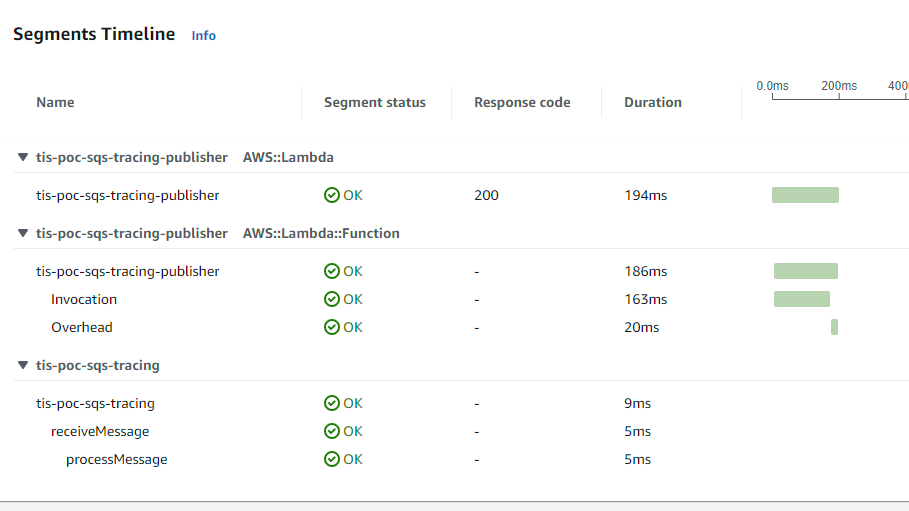

# TIS Proof of Concept: SQS Tracing

## About
This is a proof of concept for continuous tracing with SQS messages.

## Running

LocalStack cannot be used for testing as the trace header is ignored.

An SQS queue (`tis-poc-sqs-tracing-receive`) has been set up, along with a
lambda which can publish traceable messages (`tis-poc-sqs-tracing-publisher`).

Running the `EmptyInvocation` test will send a message to the queue and will be
picked up by this service running locally.

A local X-Ray daemon can be used to send the trace data to CloudWatch. For
example, with docker compose:
```yml
  xray-deamon:
    container_name: xray-deamon
    image: amazon/aws-xray-daemon:latest
    command: --local-mode
    environment:
      - AWS_ACCESS_KEY_ID
      - AWS_SECRET_ACCESS_KEY
      - AWS_REGION
    ports:
      - "2000:2000/tcp"
      - "2000:2000/udp"
```

## Output


## Versioning
This project uses [Semantic Versioning](semver.org).

## License
This project is license under [The MIT License (MIT)](LICENSE).
